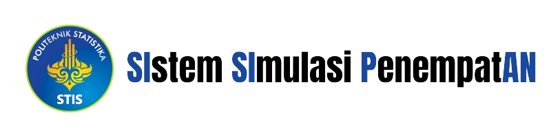

# Sisipan

Sisipan merupakan aplikasi penempatan mahasiswa yang dibangun dengan [Jetpack Compose][compose].

Untuk mencoba proyek ini, gunakan versi stabil android studio terbaru [Android Studio](https://developer.android.com/studio) dan clone repository ini

### Status: 🚧 In progress 🚧

Sisipan masih dalam tahap pengembangan.


## Screenshots


## Features


## License

```
Copyright 2020 The Android Open Source Project

Licensed under the Apache License, Version 2.0 (the "License");
you may not use this file except in compliance with the License.
You may obtain a copy of the License at

    https://www.apache.org/licenses/LICENSE-2.0

Unless required by applicable law or agreed to in writing, software
distributed under the License is distributed on an "AS IS" BASIS,
WITHOUT WARRANTIES OR CONDITIONS OF ANY KIND, either express or implied.
See the License for the specific language governing permissions and
limitations under the License.
```
